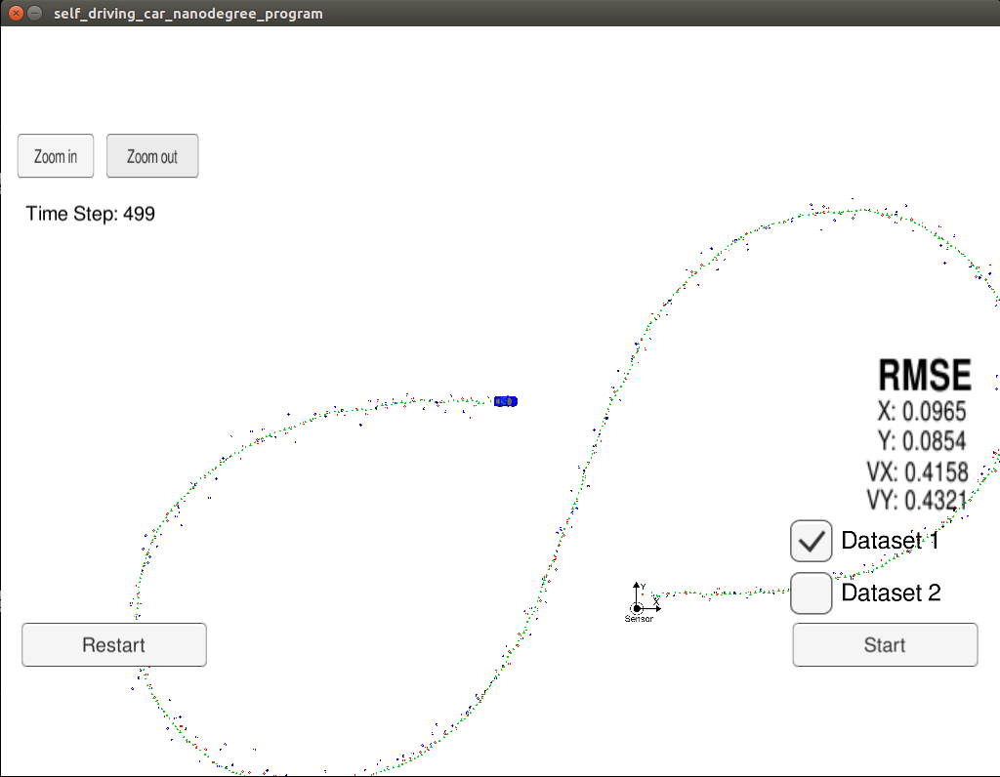
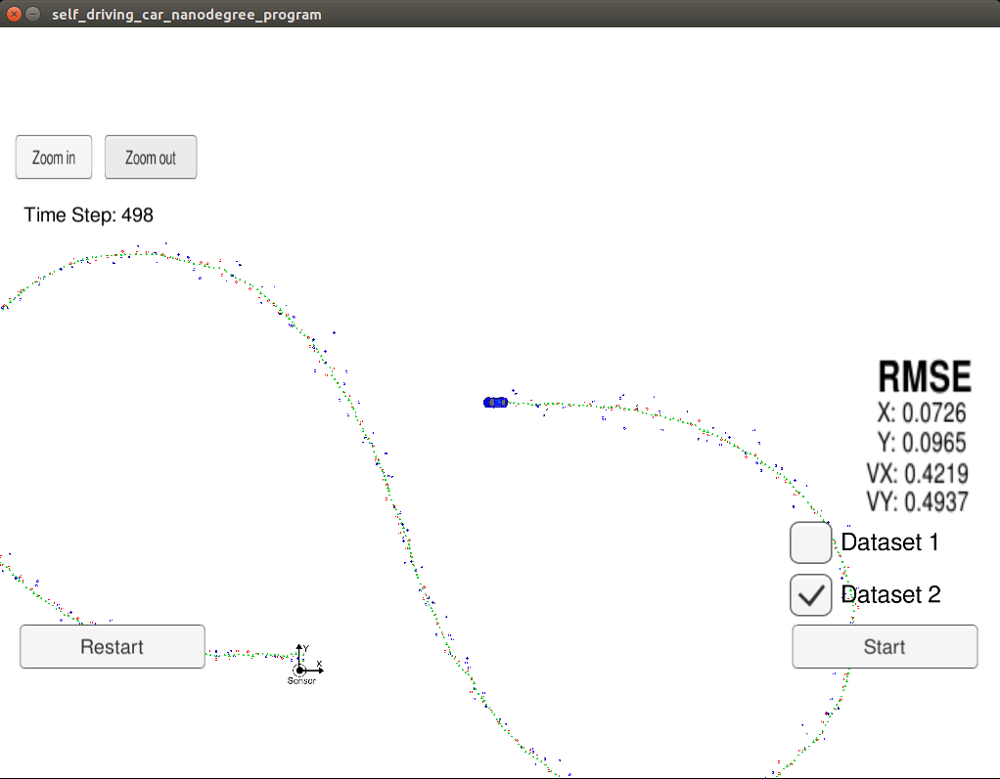
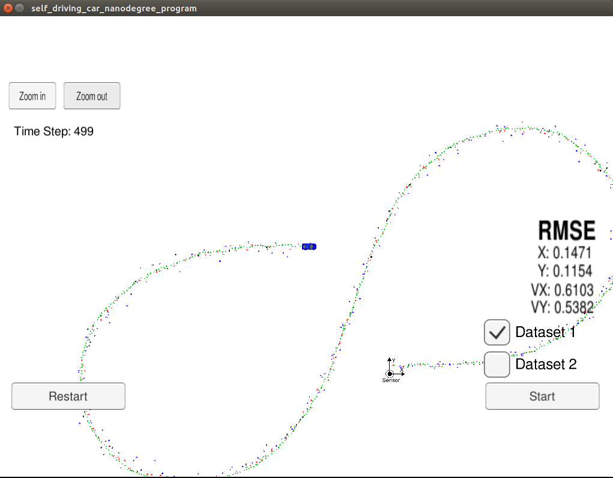
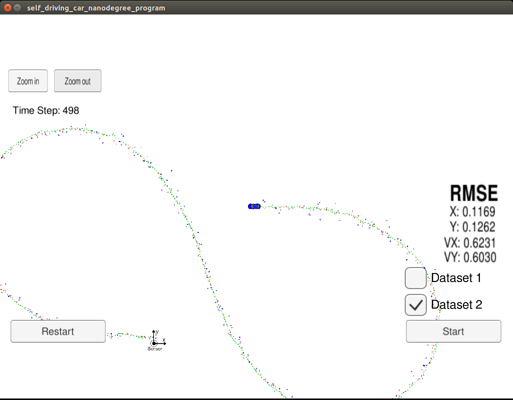
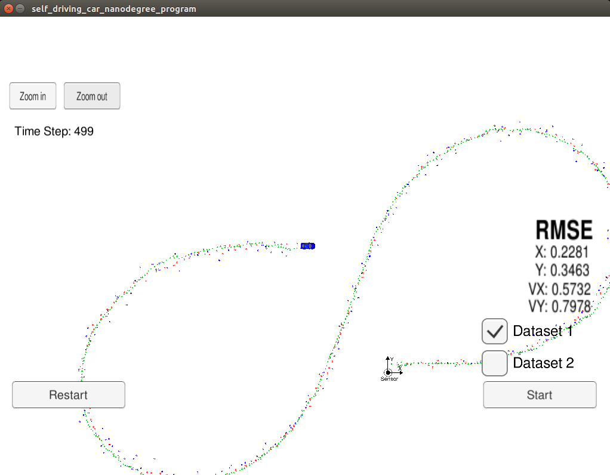
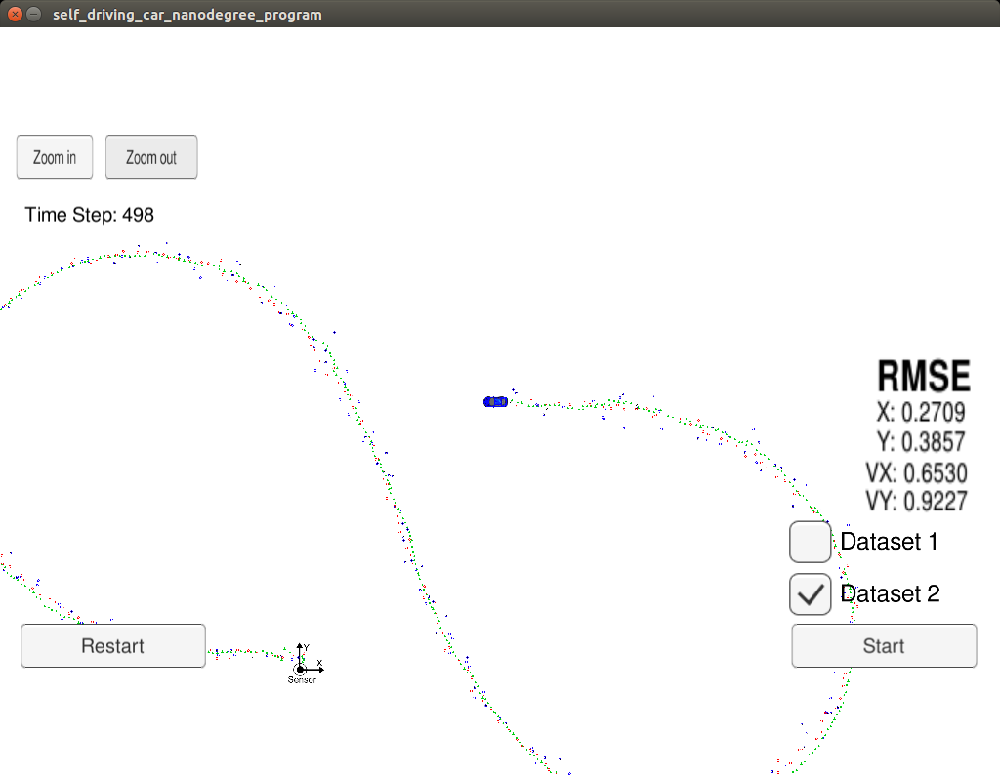

# Extended Kalman Filter Project

Self-Driving Car Engineer Nanodegree Program

# Overview
In this project a Kalman Filter was implemented to estimate the state of a moving object of interest with noisy lidar and radar measurements. 
The project implementation achieved required RMSE values that are lower than the tolerance outlined in the project rubric. 

# Prerequisites

The project has the following dependencies:

- cmake >= 3.5
- make >= 4.1
- gcc/g++ >= 5.4
- Udacity's [simulator](https://github.com/udacity/self-driving-car-sim/releases)

Instructions on how to install the required components are available on [Udacity's original project repository](https://github.com/udacity/CarND-Extended-Kalman-Filter-Project). 

This implementation was completed on Ubuntu 16.04.
In order to install the necessary libraries, use the [install-ubuntu.sh](./install-ubuntu.sh).

# Compiling and executing the project code

1. Clone this repo.
2. Make a build directory: `mkdir build && cd build`
3. Compile: `cmake .. && make` 
4. Run the executable: `./ExtendedKF `

The output is following:

`Usage: ./ExtendedKF <data_options>`

`Data options:`

	-L         :Use laser data only
	-R         :Use radar data only	
	-LR or -RL :Use both laser and radar data
	
Running the executable with -LR or -RL options uses data from both Laser and Radar sensors.

`./ExtendedKF -LR`

Running the executable with -L option uses only data from Laser sensor for fusion.

`./ExtendedKF -L`

Running the executable with -R option uses only data from Radar sensor for fusion.

`./ExtendedKF -R`

Anything other than the above options will be rejected and the code will exit.
	
Following is simulation final state after running the code with both Laser and Radar sensor data from dataset 1. The reported RMSE values meet the requirements of the project.

Following is simulation final state after running the code with both Laser and Radar sensor data from dataset 2. The reported RMSE values meet the requirements of the project.

Following is simulation final state after running the code with fusion of only Laser sensor data from dataset 1. The reported RMSE values are above the requirements.

Following is simulation final state after running the code with fusion of only Laser sensor data from dataset 2. The reported RMSE values are above the requirements.

Following is simulation final state after running the code with fusion of only Radar sensor data from dataset 1. The reported RMSE values are above the requirements of the project. The position RMSE values are from 2 to 3 times higher than the values from Laser only data. The velocity RMSE values seem to be comparable with the values from Laser only data.

Following is simulation final state after running the code with fusion of only Radar sensor data from dataset 2. The reported RMSE values are above the requirements of the project. The position RMSE values are from 2 to 3 times higher than the values from Laser only data. The velocity RMSE values seem to be comparable with the values from Laser only data.

# [Rubric](https://review.udacity.com/#!/rubrics/748/view) points

## Compiling

### The code should compile

The code compiles without errors or warnings

## Accuracy

### px, py, vx, vy output coordinates must have an RMSE <= [.11, .11, 0.52, 0.52] when using the file: "obj_pose-laser-radar-synthetic-input.txt which is the same data file the simulator uses for Dataset 1"

The values of RMSE when running the code with both Laser and Radar data are following:

- [Results with Dataset 1](results/test_result_Laser_Radar_Dataset_1.txt): Estimation size: 499, RMSE: 0.0964425, 0.0852905, 0.415426, 0.431636
- [Results with Dataset 2](results/test_result_Laser_Radar_Dataset_2.txt): Estimation size: 498, RMSE: 0.0725678, 0.0964738, 0.421634, 0.493199

## Following the Correct Algorithm

### Your Sensor Fusion algorithm follows the general processing flow as taught in the preceding lessons.

The Kalman filter implementation can be found in [kalman_filter.h](./src/kalman_filter.h) and [kalman_filter.cpp](./src/kalman_filter.cpp).

The FusionEKF implementation can be found in [FusionEKF.h](./src/FusionEKF.h) and [FusionEKF.cpp](./src/FusionEKF.cpp).

The Tools implementation can be found in [tools.h](./src/tools.h) and [tools.cpp](./src/tools.cpp).

### Your Kalman Filter algorithm handles the first measurements appropriately.

The first measurement is handled in [FusionEKF.cpp](./src/FusionEKF.cpp) from line 75 to line 120. 

### Your Kalman Filter algorithm first predicts then updates.

The prediction step was implemented in the function RunPrediction of [FusionEKF.cpp](./src/FusionEKF.cpp) at line 166 and run at line 126.

The prediction step was followed by update step at lines 131 and 152. The update step called the Kalman Filter functions Update or UpdateEKF depending on the type of sensor data.

### Your Kalman Filter can handle radar and lidar measurements.

The FusionEKF implementation [FusionEKF.cpp](./src/FusionEKF.cpp) can handle both types of sensor data from Laser and Radar.

It handles the first measurement from line 75 to line 120.

If handles subsequent samples of measurements for update steps from line 131 to line 152.

## Code Efficiency

An example of code efficiency is in [kalman_filter.cpp](./src/kalman_filter.cpp) initialisation (from line 19 to line 41), where the R-matrices for different sensor data types and the identity matrix are pre-set. It minimises the number of update required during fusion.

A simple command line data option selection was implemented in [main.cpp](./src/main.cpp) to select what sensor data to use in fusion (line 36 to line 62). The data option was then passed to the contructor of FusionEKF (line 68 to line 78 in [main.cpp](./src/main.cpp)).

### Your algorithm should avoid unnecessary calculations

An example of avoiding unnecessary calculations is in [FusionEKF.cpp](./src/FusionEKF.cpp), where the F and Q matrices get updated (from line 182 to line 193) with time difference between samples.

